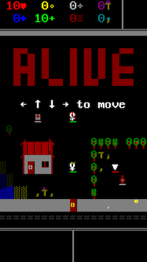

# Alive

ASCII-based 2D adventure game. Using React and Three.js (with react-three-fiber).

Only the 256 characters in code page 437 from the "DOS Font" are used (available here: https://laemeur.sdf.org/fonts/), along with original 16 terminal colors. To create all sprites, characters are stacked over each other (with the only exception of health bars, they are underscores `_` transformed to the appropriate length).

## Demo

Play it here: https://ab-und-zu.github.io/alive

_Spawn area with intro quest_

## Creatures

- Player
- Prism (linear)
- Eye (following)
- Fairy (fleeing)
- Question mark (mimicking)
- Shark (swimming)
- Alphabet boss (towers casting)

## Tribes

- Fire (red hair, burn trees)
- Water (blue hair, freeze water)
- Earth (green hair, mine rocks)

## Villagers

- Druid/Nomad/Smith/Guard/Rogue/Scout/Baker/Forge/Chief/Elder/Miner/Mage (trade)

## Units

- Chest
- Portal
- Door

## Actions

- Door unlock
- Villager shop ($)
- Villager quest (!)

## Items

- Heart
- Mana
- Experience
- Gold
- Seed
- Herb
- Sword (wood, iron, gold, fire, ice)
- Shield
- Compass
- Spell (lvl 1 and 2)
- Pickaxe
- Boat
- Bow
- Arrow
- Key

## Spells

- Fire (burning)
- Ice (freezing)
- Shield (attacking)
- Heal (healing)
- Amulet (increase drop chance)
- Bow (elemental, dropping arrow on miss)

## Conditions

- Burning (damage)
- Frozen (rooted)
- Swimming (slowed)
- Diving (oxygen)

## Biomes

- Spawn (walk, collect, attack, talk, use)
- Village
- Boss
- Forest (trees)
- Rocks
- Lakes (islands)
- Desert (cacti)
- Ocean (deep water)
- Ice
- Volcano (lava)

## Worlds

- Green (forest, rocks, lakes, desert)
- Red (rocks, volcano, desert)
- Blue (rocks, lakes, ocean, ice)

## Weather

- Snowing (freezing)
- Raining (extinguish)
- Mist (fog)

## Terrain

- Air (empty)
- Path
- Rock
- Sand
- Ice (slippery?)
- Water (splash waves, dripping)
- Soil (plant)
- Fence
- Tree
- Cactus (spikes)
- Flower
- Bush
- Fence and door

## Animations

- Damage (number behind target)
- Collect (flow towards entity)

## Tech debt

- <Terminal> only rerenders on reference frame changes, but does not listen to displayable entities
- Animations mutate state and don't really animate things, maybe better called Sequences
- Compass needle could be an animation and particle
- Make banner text floating
- Attacking should have a bump movement
- Colors should be available without star import
- Pressed button could be implemented in ECS system rather than React state
- Sprite "none" should be obsolete
- Opacity overlaps individual sprites, should be animated color to black
- Touch origin should create an anchor and display current direction
- Unlocking could be a reverse collecting animation
- Houses should be part of a larger structure
- Patterns could execute directly after each other, maybe by indicating a return value once finished
- Dialog does not need to flip if out of range
- Units moving in front of AI in the right time will disupt pathfinding due to discarded path items
- Trading doesn't support requiring multiple items of same type or with amount larger than 1
- Trading action displays maximum of 2 items

